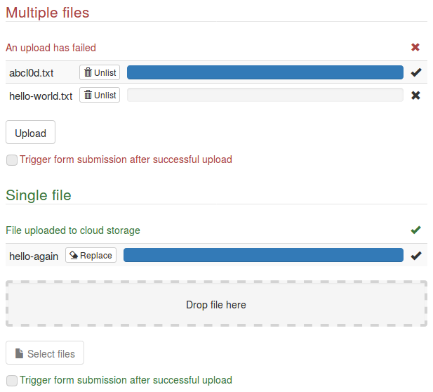

Angular Schema Form Cloud Uploader Add-on
=========================================

Cloud uploader add-on for [Angular Schema Form](https://github.com/json-schema-form/angular-schema-form), using [Angular File Upload](https://github.com/nervgh/angular-file-upload).

The form type `cloud-uploader` (used with the Bootstrap Decorator) generates a field set for selecting files and uploading them to a remote location, and saves the file names in the form model. Cloud storage, such as [Amazon S3](http://docs.aws.amazon.com/AmazonS3/latest/API/sigv4-HTTPPOSTForms.html) (see [how to configure CORS for a bucket](http://docs.aws.amazon.com/AmazonS3/latest/dev/cors.html)) or [Google Cloud Storage](https://cloud.google.com/storage/docs/xml-api/post-object) (see [how to configure CORS for a bucket](https://cloud.google.com/storage/docs/cross-origin)), is the anticipated use case.

(This is probably clear, but just in case: this is a package _for_ Angular, Angular File Upload, Bootstrap, and Angular Schema Form, but it is not affiliated with any of them.)


Contents
--------

- [Examples and description](#examples-and-description)
- [Installation and usage](#installation-and-usage)
- [Options and behavior](#options-and-behavior)
  - [Relevant schema options and field validity](#relevant-schema-options-and-field-validity)
  - [Uploader options](#uploader-options)
  - [Queue options](#queue-options)
  - [Drop zone](#drop-zone)
  - [File selection input](#file-selection-input)
  - [Submission trigger](#submission-trigger)
  - [Configuration](#configuration)
  - [Validation messages](#validation-messages)
- [Future changes; semantic versioning](#future-changes-semantic-versioning)
- [Contributions](#contributions)
- [License](#license)


Examples and description
------------------------

The minimal field schema is one of
```json
{ "type": "string" }

{ "type": "array", "items": { "type": "string"} }
```
(in the first case, only one file is allowed and its name is returned; in the second, several files are allowed and an array with their names is returned). In order to use the add-on, the form specification must include `"type": "cloud-uploader"`.

The image shows what happens for the following schema and form.

```json
{
  "type": "object",
  "properties": {
    "multiple": {
      "type": "array",
      "title": "Multiple files",
      "items": { "type": "string" },
      "description": "Files uploaded to cloud storage"
    },
    "single": {
      "type": "string",
      "title": "Single file",
      "description": "File uploaded to cloud storage"
    }
  }
}
```

```js
[{
  key: 'multiple',
  type: 'cloud-uploader',
  queueItemRemoveHtmlClass: 'btn btn-default btn-xs',
  queueItemRemoveIcon: 'glyphicon glyphicon-trash',
  triggerSubmit: 'Trigger form submission after successful upload',
  url: '' // the relevant URL
}, {
  key: 'single',
  type: 'cloud-uploader',
  dropZoneHtmlClass: 'drop-zone well',
  queueItemRemoveHtmlClass: 'btn btn-default btn-xs',
  queueItemRemoveIcon: 'glyphicon glyphicon-erase',
  queueItemRemoveLabel: 'Replace',
  selectIcon: 'glyphicon glyphicon-file',
  selectLabel: 'Select file',
  triggerSubmit: 'Trigger form submission after successful upload',
  url: '' // the relevant URL
}]
```



A field set is created for each upload field. It includes a status message (or field description), a table listing all files (and their progress), an optional drop zone, a file selection input, and an optional form submission trigger.

The table lists all files uploaded or pending (all submitted files are automatically uploaded if not unlisted before the upload completes). Each row includes a removal button: `queueItemRemoveHtmlClass` specifies the class for the button, `queueItemRemoveIcon` specifies classes for the icon (if desired), and `queueItemRemoveLabel` specifies the text of the button.

The drop zone is displayed only in HTML5 browsers, and only if `dropZoneHtmlClass` is specified (in the example `'drop-zone'` is a class defined in the stylesheet).

The file selection input is configured with `selectIcon` (classes for the icon, if desired) and `selectLabel` (text label). The button is disabled if the file limit has been reached.

The trigger selection checkbox is available only if `triggerSubmit` is provided. After the uploads complete the checkbox is disabled (it is enabled again if all files are removed from the list). If the checkbox was selected when the uploads complete, the `'submit'` event (as with `ngSubmit`) is triggered for the parent form. This is useful in cases where the user may assume it is enough to select the files and wait for the upload to complete.

There are several other options (including for specifying the remote location and for setting global defaults), discussed below.

If the abilities to send additional fields (other than the file) in the `POST` request or to remove specific files from the queue are not needed, or showing image previews is desired, the [Angular Schema Form File-Upload add-on by Netzwerkplan GmbH](https://github.com/saburab/angular-schema-form-nwp-file-upload) may be a better choice.


Installation and usage
----------------------

As other ASF add-ons do, this one manages its dependencies via [Bower](https://bower.io/). [Angular](https://angularjs.org/) (1.6), [Angular File Upload](https://github.com/nervgh/angular-file-upload), [Angular Schema Form](https://github.com/json-schema-form/angular-schema-form) and its Bootstrap Decorator, and their dependencies must all be available for this add-on to work. If they are already installed in typical locations,
```html
<script src="bower_components/angular/angular.min.js"></script>
<script src="bower_components/angular-sanitize/angular-sanitize.min.js"></script>
<script src="bower_components/angular-file-upload/dist/angular-file-upload.min.js"></script>
<script src="bower_components/tv4/tv4.js"></script>
<script src="bower_components/objectpath/lib/ObjectPath.js"></script>
<script src="bower_components/angular-schema-form/dist/schema-form.min.js"></script>
<script src="bower_components/angular-schema-form-bootstrap/bootstrap-decorator.min.js"></script>
<script src="bower_components/angular-schema-form-cloud-uploader/angular-schema-form-cloud-uploader.min.js"></script>
<link href="bower_components/bootstrap/dist/css/bootstrap.min.css" rel="stylesheet" />
```
inside `<head></head>` invokes all required files, and
```js
angular.module('app', ['schemaForm', 'angularSchemaFormCloudUploader']);
```
creates an app including this add-on.

In a system with Bower already installed,
```
$ bower install angular-schema-form-cloud-uploader
```
installs all dependencies.

The add-on can be installed from [npm](https://www.npmjs.com/), with
```
$ npm install angular-schema-form-cloud-uploader
```
which also invokes `bower install` if available.

To work with the package as a stand-alone, clone the repository:
```
$ git clone https://github.com/jboavida/asf-cloud-uploader.git
```
creates a new directory `asf-cloud-uploader` and clones the repository into it. Within the new directory, `npm install` installs all development dependencies (including Bower), `npm test` runs all tests, and `npm start` generates the minified file and starts a demo server at `http://localhost:8080/` (using the files at [`./demo`](./demo)) that accepts mock uploads at `http://localhost:8080/uploads`.


Options and behavior
--------------------

Almost all [standard options](https://github.com/json-schema-form/angular-schema-form/blob/development/docs/index.md#standard-options) are supported. `placeholder` is not applicable, `htmlClass` is applied to the entire fieldset, `fieldHtmlClass` is applied to the file input, `labelHtmlClass` is applied to the fieldset legend.

The other form options (and their defaults) are:
```js
{
  url: undefined,   // url for upload
  alias: 'file',    // field name for file content (in upload POST)
  data: {},         // additional form fields (in upload POST)
  headers: {},      // headers (for upload POST)
  maxItems: Number.MAX_VALUE,   // maximum queue size

  queueHtmlClass: 'table table-condensed table-striped',  // class for queue
  queueItemNameHtmlClass: '',                         // class for file name
  queueItemRemoveHtmlClass: 'btn btn-danger btn-xs',  // class for removal btns
  queueItemRemoveIcon: undefined,                     // removal button icon
  queueItemRemoveLabel: 'Unlist',                     // removal button label
  queueItemProgressHtmlClass: 'progress-bar',         // class for progress bar

  dropZoneHtmlClass: 'ng-hide',         // class for drop zone
  dropOverHtmlClass: 'nv-file-over',    // additional class when over drop zone

  fieldHtmlClass: 'btn btn-default',    // class for file select button
  fieldFocusHtmlClass: undefined,       // additional class for focused button
  selectIcon: undefined,                // file select button icon
  selectLabel: 'Upload',                // file select button label
  selectMultiple: true,                 // allow multiple file selection

  triggerSubmit: undefined,             // trigger submit checkbox label
  triggerSubmitHtmlClass: 'checkbox'   // class for trigger submit checkbox
}
```


### Relevant schema options and field validity

Only schemas compatible with `{ "type": "string" }` or `{ "type": "array", "items": { "type": "string" } }` are supported. Additional schema keys (such as `format` or `maxItems`) are processed as usual.

If a string schema is provided, the form option `maxItems` is set to `1` and the form option `selectMultiple` is removed.

If an array schema is provided, the schema keys `maxItems` is copied to the form option `maxItems`.

In addition to any schema validation requirements, the field is not valid if any upload failed (checked by `$validators.uploadFailed`) or if there are files waiting to be uploaded or files being uploaded (checked by `$validators.uploadOngoing`).

If the model already has a value (string or array of strings) when the form is generated, dummy files are added to the list of uploaded files, with names as provided by that value.


### Uploader options

Some options are converted into [Angular File Upload uploader options](https://github.com/nervgh/angular-file-upload/wiki/Module-API#fileuploader):

- `url` is the remote path where files are to be uploaded to;
- `alias` is the name of the form field for the file contents; this will always be the last field in the form;
- `data` is an object with additional fields (and their values) to include in the form; if the order of fields matters, an array of objects should be used (all fields from one object are added before moving on to the following object in the array); this value (or, if it is an object, the array with it) is passed on to the uploader's `formData` option;
- `headers` is an object with additional HTTP headers for the request;
- `maxItems` is passed on as `queueLimit`;
- `withCredentials` is passed on to the uploader.

Only `POST` requests are supported.

The uploader's `autoUpload` is set to `true`.


### Queue options

The upload queue is displayed in a table, whose class is set with the `queueHtmlClass` option. Each row corresponds to a file in the queue, with elements for the filename, a removal button (cancels the upload if possible and removes the file from the queue), a progress bar, and feedback.

The `queueItemNameHtmlClass` option sets the class for the filename element.

The `queueItemRemoveHtmlClass` options sets the class for the removal button (if replaced, the classes `'btn btn-default'`, or others with similar roles, need to be included in the replacement), `queueItemRemoveIcon` sets the icon class (in a span element), and `queueItemRemoveLabel` sets the text in the button. Removing a file from the queue is not reversible (and does not remove the file from the remote location if the upload had already finished); the styling (or even supporting text) should convey that irreversibility. The button can be removed by setting the class to `'ng-hide'`.

Only the [inner `div` of the progress bar](https://getbootstrap.com/docs/3.3/components/#progress) can be styled, using the option `queueItemProgressHtmlClass` (if replaced, the class `'progress-bar'`, or another with a similar role, needs to be included in the replacement). The current progress is always reported to screen readers.

The feedback element is not displayed if the `feedback` option is `false`. Otherwise, a success icon appears (unless the option `disableSuccessState` is `true`) if the upload completed successfully, and an error icon appears (unless the option `disableErrorState` is `true`) if there was an error during the upload. The status is always reported to screen readers.


### Drop zone

The drop zone is displayed only in HTML5 browsers.

The `dropZoneHtmlClass` option controls its class (if missing, `'ng-hide'` is used, effectively making the drop zone invisible), while `dropOverHtmlClass` contains additional classes for when the files to be dropped are already over the drop zone. (This uses [`nvFileDrop` and `nvFileOver`](https://github.com/nervgh/angular-file-upload/wiki/Module-API#directives) from Angular File Upload; `dropOverHtmlClass` is passed on to `over-class`.)


### File selection input

The file selection input is actually displayed as the label for a file input control that is displayed only for screen readers. (The input control uses [`nvFileSelect`](https://github.com/nervgh/angular-file-upload/wiki/Module-API#directives) from Angular File Upload.)

The option `fieldHtmlClass` sets the class for the label. The option `fieldFocusHtmlClass` sets what classes to add when the control is in focus. (If the users' browsers are known to support the [`:focus.within` pseudo-class](https://developer.mozilla.org/en-US/docs/Web/CSS/:focus-within), it may be used instead.) The option `selectIcon` sets the icon class (in a span element), and `selectLabel` sets the text in the button.

If a string schema was used for the field, or `maxItems` was set to `1` (either in the schema or as a form option), or the option `selectMultiple` was set to `false`, the file input will allow selection of a single file. Otherwise, it will allow multiple files.


### Submission trigger

In some forms, it may appear to users that once uploads finish, the form is automatically submitted (or does not need to be). The user should always control form submission, but sometimes it is indeed necessary that the form be explicitly submitted. For such cases, the submission trigger lets the user stay in control, while providing (via its label) indication that submission (either automated or manual) is indeed necessary.

The option `triggerSubmit` specifies the label for the checkbox. The checkbox is made available only if this label is provided. Only the [outer `div` of the checkbox](https://getbootstrap.com/docs/3.3/css/#checkboxes-and-radios) can be styled, using the option `triggerSubmitHtmlClass` (if replaced, the class `'checkbox'`, or another with a similar role, needs to be included in the replacement).

The submission trigger checkbox is enabled only when the queue is empty or there are ongoing uploads. The trigger is activated when the uploads finish, but only if the field is valid, no upload failed, and the queue is not empty.


### Configuration

Usually, we want similar defaults for all similar fields. Defaults are provided by the `asfCloudUploaderDefaults` service; all form options may have defaults configured. For example,
```js
angular.module('angularSchemaFormCloudUploader').run([
  'asfCloudUploaderDefaults', function (defaults) {
    angular.extend(defaults, {
      dropZoneHtmlClass: 'drop-zone well',
      dropOverHtmlClass: 'drop-over',
      queueItemRemoveHtmlClass: 'btn btn-default btn-xs',
      queueItemRemoveIcon: 'glyphicon glyphicon-trash',
      selectIcon: 'glyphicon glyphicon-file',
      triggerSubmit: 'Trigger form submission after successful upload'
    });
  }
]);
```
sets defaults very close to those of the examples above. (Note that `angular.extend` is necessary if we wish to maintain the defaults that are not being replaced.)

To set different defaults for different controllers, we can use a [decorator](https://docs.angularjs.org/guide/decorators) and make a shallow copy of the original value before modifying it:
```js
angular.module('app').config(['$provide', function($provide) {
  $provide.decorator('asfCloudUploaderDefaults', [
    '$delegate', function (defaults) {
      defaults = angular.copy(defaults);
      angular.extend(defaults, {
        dropZoneHtmlClass: 'drop-zone well',
        dropOverHtmlClass: 'drop-over',
        queueItemRemoveHtmlClass: 'btn btn-default btn-xs',
        queueItemRemoveIcon: 'glyphicon glyphicon-trash',
        selectIcon: 'glyphicon glyphicon-file',
        triggerSubmit: 'Trigger form submission after successful upload'
      });
      return defaults; // don't forget this
    }
  ]);
}]);
```
In this example, the changes apply only to that app.

Another possibility is to set [global options](https://github.com/json-schema-form/angular-schema-form/blob/development/docs/index.md#global-options) for the form.


### Validation messages

This add-on has two additional error types: `'uploadFailed'` is present if there was an error if an upload, `'uploadOngoing'` is present if there are pending uploads.

There are several [ways to configure the validation messages](https://github.com/json-schema-form/angular-schema-form/blob/development/docs/index.md#validation-messages).

For example,
```js
angular.module('app').config([
  'sfErrorMessageProvider', function (sfErrorMessageProvider) {
    sfErrorMessageProvider.setDefaultMessage(
      'uploadFailed', 'An upload is broken'
    );
  }
]);
```
replaces the `'uploadFailed'` message for the entire app.


Future changes; semantic versioning
-----------------------------------

This package started as a submodule of another project. I factored it out as a stand-alone module and cleaned it up enough to make it easy to maintain, but I'm still adjusting it as needed for the other project.

I intend to follow semantic versioning. I don't expect to make big changes, but there are some areas where changes may be needed:

- I'm not sure all those options to control classes of different subcomponents are really needed, or are all that are needed;
- I may end up needing some practical way to replace the structure of some subcomponents (possibly leveraging the template cache to make it reasonably easy to configure);
- I tried to make all components accessible (checking focus options, tab index, keyboard interaction, etc.), but it's likely I missed something.

On the other hand, it does not make much sense to make big changes before the next version of Angular Schema Form is released. So, I'm very likely to make only changes that are clearly needed (or helpful) for the other project.


Contributions
-------------

Until I'm confident the package is sufficiently stable, I won't accept code contributions.

Issues (bug reports, suggestions, etc.) are welcome, but I may take some time to get to them.


License
-------

Copyright © 2017 João Pedro Boavida. Licensed under the [MIT License](LICENSE).
